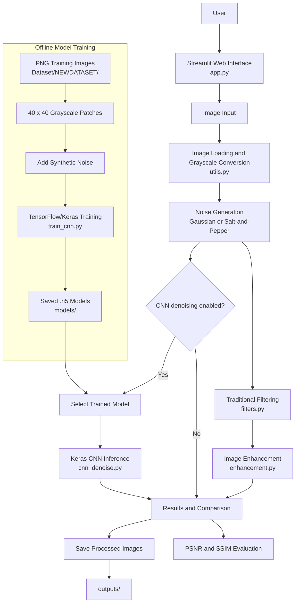

# Image Enhancement and Noise Reduction

## 1. Project purpose

This project is an image-processing application for improving grayscale image quality. It demonstrates three complementary approaches:

1. **Synthetic noise generation** so denoising methods can be tested with controlled input.
2. **Traditional image-processing filters and enhancement methods** implemented with OpenCV and NumPy.
3. **Deep-learning denoising** using trained convolutional neural networks.

The user interface is built with Streamlit. A user can upload an image, add Gaussian or salt-and-pepper noise, apply filters and enhancement operations, run a CNN denoiser, compare results, and save the processed images.

## 2. Main project components

| File or directory | Purpose |
|---|---|
| `app.py` | Streamlit interface and end-to-end image-processing workflow |
| `filters.py` | Average, Gaussian, median, bilateral, sharpening, and morphological filters |
| `enhancement.py` | Histogram equalization, CLAHE, adaptive equalization, contrast stretching, and gamma correction |
| `utils.py` | Image loading, normalization, noise generation, and output helpers |
| `cnn_denoise.py` | Trained Keras CNN model loading and inference |
| `train_cnn.py` | Parameterized training script: trains the 4-layer CNN denoiser for any noise regime (Gaussian σ15/25/35, salt & pepper) |
| `Dataset/NEWDATASET/` | PNG images used to generate training patches |
| `models/` | Saved trained Keras models in HDF5 format |
| `outputs/` | Destination for processed images produced by the application |

## 3. Application workflow

The normal processing path is:

```text
Upload image
    -> Convert to grayscale
    -> Add selected synthetic noise
    -> Apply selected traditional filters
    -> Apply selected enhancement operations
    -> Optionally run CNN denoising
    -> Display comparisons and quality metrics
    -> Save output images
```

The original image is retained as a reference. This makes it possible to compare the noisy image and each processed result visually and, where applicable, with PSNR.

## 4. System architecture



### Architecture layers

1. **Presentation layer:** `app.py` provides the Streamlit controls, image previews, processing selections, metrics, and save actions.
2. **Input and utility layer:** `utils.py` loads images, converts them into the expected format, generates noise, and saves outputs.
3. **Classical image-processing layer:** `filters.py` and `enhancement.py` apply smoothing, edge-preserving filters, morphology, contrast enhancement, and brightness adjustment.
4. **Deep-learning inference layer:** `cnn_denoise.py` loads the saved Keras `.h5` model and converts images between NumPy arrays and model tensors.
5. **Offline training layer:** the training scripts read clean PNG images, create noisy patch pairs, train CNN models, and save them under `models/`.
6. **Storage layer:** `Dataset/NEWDATASET/` contains training inputs, `models/` contains trained weights, and `outputs/` contains generated results.

The application and training workflow are intentionally separated. Training is performed offline and produces reusable model files; the Streamlit application only loads those files for inference.

## 5. Traditional processing methods

### Noise generation

- **Gaussian noise** adds random values sampled from a normal distribution.
- **Salt-and-pepper noise** randomly changes pixels to black or white.

These methods provide repeatable experiment types without requiring a separately corrupted dataset.

### Filters

- **Average filter:** smooths an image using a local mean, but may blur edges.
- **Gaussian blur:** performs weighted smoothing and is effective for general noise reduction.
- **Median filter:** replaces each pixel with the neighborhood median and is particularly useful for salt-and-pepper noise.
- **Bilateral filter:** smooths while preserving strong edges.
- **Sharpening filter:** emphasizes local detail and edges.
- **Morphological opening:** reduces small bright structures and isolated noise.
- **Morphological closing:** fills small dark gaps and connects nearby structures.

### Enhancement methods

- **Histogram equalization:** expands global intensity distribution.
- **CLAHE:** improves local contrast while limiting over-amplification.
- **Adaptive histogram equalization:** adjusts contrast according to local regions.
- **Contrast stretching:** maps a limited input range to a wider output range.
- **Gamma correction:** changes brightness using a nonlinear intensity transformation.

Filtering primarily targets noise, while enhancement targets visibility, contrast, and detail. Applying too many operations can remove useful information or exaggerate artifacts, so the application allows them to be selected independently.

## 6. CNN training script: `train_cnn.py`

This single parameterized script trains a small Keras CNN to reconstruct clean image patches from patches corrupted with synthetic noise. The noise regime is chosen on the command line, replacing the four legacy scripts:

```bash
python train_cnn.py --noise-type gaussian --noise-param 35
python train_cnn.py --noise-type salt_pepper --noise-param 0.1
```

For a Gaussian run with sigma **35**, the pipeline works as follows.

### 5.1 Dataset loading and patch extraction

`load_dataset_patches()`:

1. Validates that `./Dataset/NEWDATASET` exists.
2. Finds PNG files in that directory.
3. Reads each image as grayscale.
4. Converts pixel values from `[0, 255]` to `[0, 1]`.
5. Splits each image into non-overlapping `40 x 40` patches.
6. Creates Gaussian noise with standard deviation `35 / 255`.
7. Clips noisy values back to `[0, 1]`.
8. Returns paired arrays:
   - `noisy_patches`: model inputs
   - `clean_patches`: expected outputs

Patches are stored with a channel dimension, producing tensors shaped like:

```text
(number_of_patches, 40, 40, 1)
```

Images whose height or width is not an exact multiple of 40 have their remaining border pixels ignored by the patch loops.

### 5.2 Model architecture

`build_cnn_denoiser()` creates a sequential fully convolutional model:

```text
Input:       40 x 40 x 1
Conv2D:      32 filters, 3 x 3, ReLU
Conv2D:      32 filters, 3 x 3, ReLU
Conv2D:      32 filters, 3 x 3, ReLU
Conv2D:       1 filter,  3 x 3, linear output
```

All convolutions use `padding="same"`, so the output remains `40 x 40 x 1`. The network predicts the clean image directly rather than predicting a residual noise map.

The model is compiled with:

- **Optimizer:** Adam
- **Learning rate:** `0.001`
- **Loss:** mean squared error (MSE)
- **Metric:** mean absolute error (MAE)

### 5.3 Training configuration

Defaults (overridable via CLI flags `--patch-size`, `--noise-param`, `--batch-size`, `--epochs`):

| Setting | Default |
|---|---:|
| Patch size | `40 x 40` |
| Noise type / param | `gaussian` / `25` |
| Batch size | `16` |
| Epochs | `8` |
| Validation split | `10%` |
| Input/output channels | `1` grayscale channel |

Training shuffles the patches before each epoch. The returned Keras history contains training and validation loss/MAE values.

### 5.4 Model output

After training, the script creates `models/` if necessary and saves, for example:

```text
models/cnn_denoiser_sigma35.h5
```

The final training loss and validation loss are printed so the run can be reviewed quickly.

## 7. CNN inference

`cnn_denoise.py` loads the trained Keras `.h5` denoising models for inference.

For the Keras path, the input image is:

1. Converted to `float32`.
2. Normalized to `[0, 1]`.
3. Expanded to batch and channel dimensions.
4. Passed through the model.
5. Converted back to an 8-bit grayscale image in `[0, 255]`.

The model is trained on `40 x 40` patches, while inference can receive a full image because the network is fully convolutional. The returned image is resized if its shape does not match the original input.

When selecting a model, the model's training noise should match the expected input noise as closely as possible. For example, `cnn_denoiser_sigma35.h5` is intended for images with Gaussian noise around sigma 35. A model trained for one noise distribution may perform poorly on another.

## 8. Installation and execution

From the project directory:

```bash
pip install -r requirements.txt
streamlit run app.py
```

The application is then available at `http://localhost:8501`.

To retrain, for example, the sigma-35 model:

```bash
python train_cnn.py --noise-type gaussian --noise-param 35
```

The training command expects PNG files under:

```text
Dataset/NEWDATASET/
```

The model is saved under `models/` after a successful run.

## 9. Evaluation considerations

The application compares outputs using visual inspection, PSNR, and SSIM. When a clean reference image is available, additional useful metrics include:

- **MSE:** average squared pixel error.
- **MAE:** average absolute pixel error.
- **PSNR:** logarithmic measure of reconstruction quality.
- **SSIM:** structural similarity, which better reflects perceived image structure.

Metrics should be calculated against the same clean reference and at the same image dimensions. A higher PSNR or SSIM is not sufficient by itself; edge preservation and diagnostic detail should also be checked for medical or scientific images.

## 10. Important limitations

- The training script uses non-overlapping patches, so it does not learn from overlapping local views.
- Border regions that do not fit a complete `40 x 40` patch are skipped during training.
- Noise is generated randomly each time the script runs, so exact training results can vary.
- A model trained for Gaussian noise is not automatically suitable for salt-and-pepper noise.
- Traditional enhancement operations can improve visibility while also amplifying noise if used before denoising.

## 11. Summary

This project combines classical digital image processing with deep learning in a single interactive application. The traditional methods provide transparent, fast baselines, while the CNN models learn a direct mapping from noisy grayscale patches to clean patches. The `train_cnn.py` script produces the four-convolution Keras denoisers for each noise regime, and the resulting models are loaded by the application's Keras inference path for full-image denoising.
